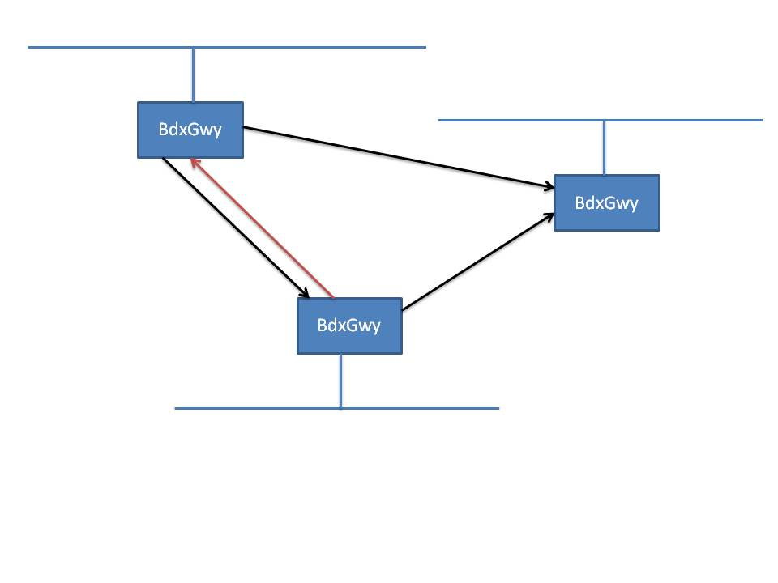

## Distributor Broadcast Gateway

This document describes the functionality and flow of the the _Distributor Broadcast Gateway_ herby named **_bdxgwy_**.

The _bdxgwy_ is not a program rather is a set of classes making it possible to develop a gateway app allowing published 
broadcasts to be exported/imported  to/from a remote LANs using a p-2-p connections. The communication between two _bdxgwys_ 
are compress using Zip compression.

A _bdxgwy_ could be setup to work as a receiver of broadcast from a remote LAN or a sender of local broadcast to a remote LAN or both.

A _bdxgwy_ could be configured to connect to multiple remote _bdxgwys_. I could also be connfigured  accept inbound connections 
from multiple remote _bdxgwys_. 

As said, there is no bdxgwy app develop, rather there is a few classes implementing the essential logic. What typically is 
missing to have a complete app, is how to handle the configuration, start stop of the gateway. 

The main class to build the gateway around is the [BroadcastGateway](https://htmlpreview.github.io/?https://github.com/hoddmimes/Distributor/tree/master/javadoc/com/hoddmimes/distributor/bdxgwy/BroadcastGateway.html).

A _bdxgwy_ solution can be very simple just relaying broadcast from one LAN to a remote LAN. But can also be complicated 
with multiple remote LANs exporting and importing in various directions.

Worth knowing is that internal protocol messages such as, configuration, heartbeats etc. on a LAN is never exported out via a gateway. _Broadcasts received 
from a remote LAN is just broadcasted locally and never redistributed out to a remote gateway. So there should be no 
risk for looping broadcast messages._

A _bdxgwy_ is not just pushing all local broadcast senseless to remote LANs. They way the a _bdxgwy_ works is that local 
subscriber applications will connect to the local bdxgwy an inform the _bdxgwy_ what subjects they have an interest in. 
The local _bdxgwy_ will forward this information to remote gateways from which the _bdxgwy_ imports / receive broadcasts.

So a _bdxgwy_ is only exporting broadcast for which there is a remote interest. In case a local subscriber application 
removes a subscription or terminates remote _bdxgwys_ are notified.

Subscriber applications that would like to inform remote _bdxgwys_ updates about their interest needs to connect to the local _bdxgwy_ about their interest, which will forward their interests.
This is configured via the 
[DistributorApplicationConfiguration](https://htmlpreview.github.io/?https://github.com/hoddmimes/Distributor/tree/master/javadoc/com/hoddmimes/distributor/DistributorApplicationConfiguration.html) object.

This is done by setting the bdxgwy *host* and *port* by invoking the methods [setBroadcastGatewayAddress](https://htmlpreview.github.io/?https://github.com/hoddmimes/Distributor/tree/master/javadoc/com/hoddmimes/distributor/DistributorApplicationConfiguration.html#setBroadcastGatewayAddress(java.lang.String))
and [setBroadcastGatewayPort](https://htmlpreview.github.io/?https://github.com/hoddmimes/Distributor/tree/master/javadoc/com/hoddmimes/distributor/DistributorApplicationConfiguration.html#setBroadcastGatewayPort(int))
  
The communication between a subscriber app and a _bdxgwy_ is P-2-P tcp/ip (uncompressed). 
A _bdxgwy_ serving multiple subscription apps will import the union of all subscription app interests. 

There is some code examplifying a gateways setup / funcionality in the directory [pubsub/java/main/com/hoddmimes/distributor/samples/bdxgwy](https://github.com/hoddmimes/Distributor/tree/master/pubsub/java/main/com/hoddmimes/distributor/samples/bdxgwy)
The configuration files to these sample programs are found the [pubsub](https://github.com/hoddmimes/Distributor/tree/master/pubsub) directory. The assumption is that the two LANs 192.168.42.0/24 
and 192.168.1.0/24 are connected via a routed network. One _bdxgwy_ and a _pusblisher_ application is running on the host 192.168.42.100 and one _bdxgwy_ and publisher is running on the host 192.168.1.100
 